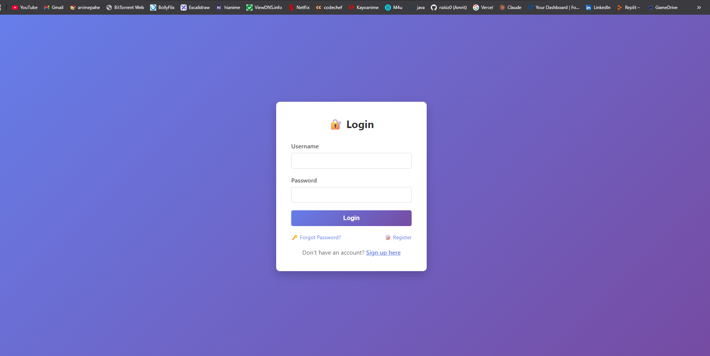
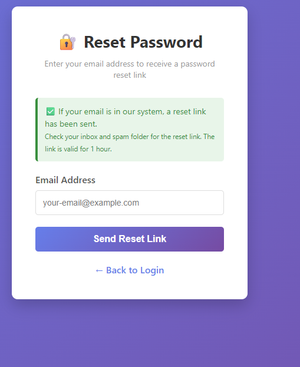
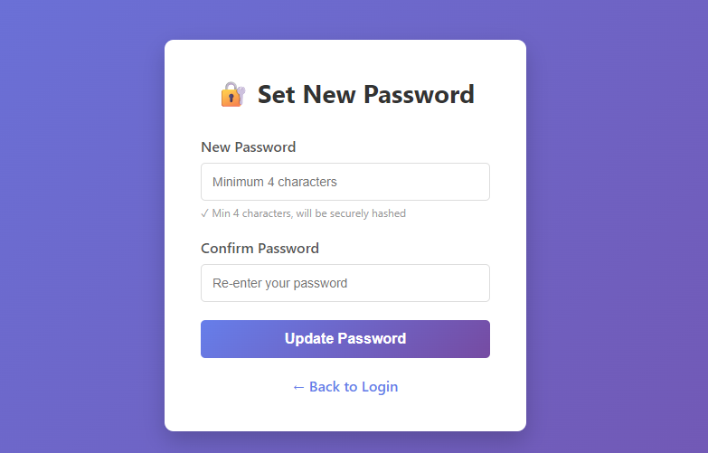
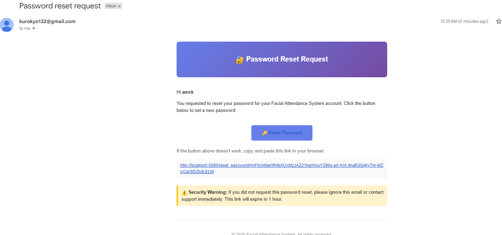
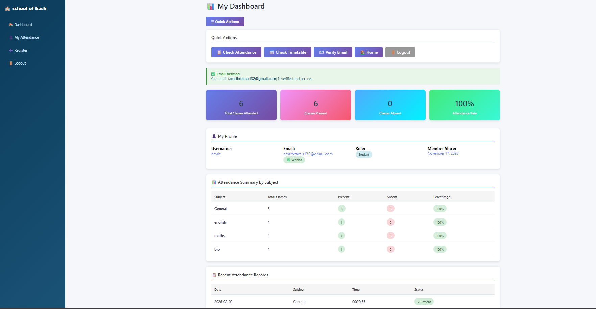
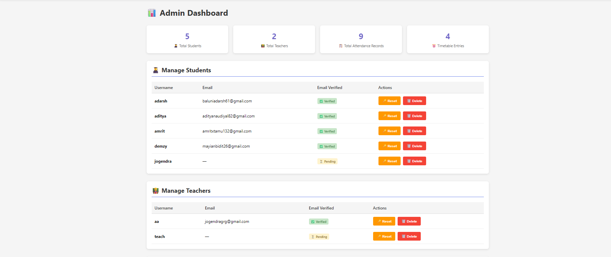
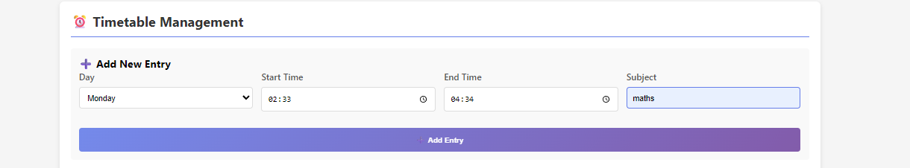

# 🎓 Facial Attendance System

A full-stack **Facial Attendance System** using face recognition, email verification, and role-based access control.

---

## 🖼️ Application Screenshots
This section showcases the complete workflow and features of the system.

---

## 🔐 Authentication & Account Security

### Login Page
User login interface with credential validation.  

---

### Password Reset Request
Users can request a password reset using their registered email.  

---

### Email Sent for Password Reset
Secure password reset link sent to the user’s email.  

---

### Set New Password
User sets a new password via a secure, time-limited token.  

---

### Password Reset Confirmation
Confirmation screen after successful password update.  

---

## 📧 Email Notifications

### Attendance Marked Email
Automated email sent when attendance is successfully marked.  

---

## 🧑‍🎓 Student Features

### Student Dashboard
Displays attendance summary, subject-wise breakdown, and percentage.  

---

### Student Profile Overview
Shows role, email verification status, and membership info.  

---

## 📸 Face Recognition Attendance

### Face Recognition – Attendance Capture
Attendance marked using real-time face recognition via webcam.  

---

### Already Marked Attendance
Prevents duplicate attendance marking for the same day.  

---

## 🧑‍🏫 Admin & Teacher Panel

### Admin Dashboard
Overview of students, teachers, attendance records, and timetable.  

---

### Manual Attendance Marking
Manual attendance marking when face recognition is unavailable.  

---

## 📅 Timetable Management

### Timetable View
Displays the current timetable with day, time, and subject.  

---

### Updating Timetable Entries
Admins can add, edit, or delete timetable entries dynamically.  

---

## 👨‍💻 Author
**Amrit Gurung**  
Cybersecurity Student | Full-Stack Developer
